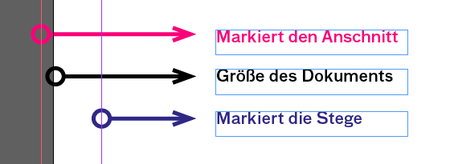

## Basics
- Neues Dokument einrichten mit mit Größe, Seiten, Spalten automatischem Textrahmen und Beschnitt:
  - Zielmedium: Druck
  - Doppelseite ja/nein
  - Seitenformat
  - Stege = Seitenränder (Kann später über `Layout > Stege und Spalten` geändert werden)
  - Anschnitt, Standardwert: 3mm (Kann später über `Datei > Dokument einrichten` geändert werden)
- 
- verschiedene Objekte auf der Zeichenfläche anlegen und über die Paletten verändern
- Bilder und Texte in ein Dokument laden und platzieren
  - einen Rechteckrahmen erstellen und Bild laden:
`Datei > Platzieren` oder Shortcut `Cmd+D`
  - im Bildrahmen kann das Bild händisch
skaliert und positioniert werden oder über
`Objekt > Anpassen` eingepasst werden:
  - 
  - Bilder können mit gedrückter `shift` Taste proportional Skaliert werden.
  - Mit gedrückter `cmd` Taste kann Bildrahmen und Bild gleichzeitig skaliert werden.
  - **WICHTIG:
Die Bilder werden im Indesign-Dokument nicht eingebettet! Verändert man das
Originalbild, verändert sich auch das platzierte Bild. Löscht man das Originalbild,
fehlt die Verknüpfung im Indesign, es kann nicht mehr gedruckt werden.**
- Farbpalette
  - Globale Farben
- Objekte duplizieren `Alt + Ziehen`
- Objekte anordnen und über die Palette Ausrichten
  - Öffnen über `Fenster > Objekt und Layout… > Ausrichten`
  - um Objekte aneinander oder an der Seite auszurichten.
- Hilfslinien anlegen. (Mit Hilfslinien ein Raster aufbauen)
  - [Tutorial zu Grids von Computerarts](http://mos.computerarts.co.uk/pdf/ART179_tut_indesign.pdf)

## Workshop

- Nachbauen einer doppelseite aus ["The age of Earthqakes"](http://www.dazeddigital.com/artsandculture/article/24283/1/inside-the-age-of-earthquakes) von Hans Ulrich Obrist, Douglas Coupland und Shumon Basar.
 
- Die Maße: 110mm x 180mm

[**Download Ordner mit Bildern**](https://github.com/milangress/inDesign101/blob/master/1_basics/workshop/workshop_basics.zip?raw=true)

Das Bild auf der linken Doppelseite ist eine Arbeit von Taryn Simon mit dem Titel: [Handbag, Louis Vuitton (Counterfeit)](https://www.artsy.net/artwork/taryn-simon-handbag-louis-vuitton-counterfeit)
