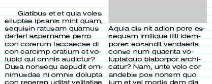
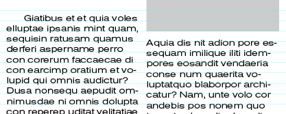

## Typo

- Typo Kontext-Palette
- Zeichenpalettes
- Absatzpalette
- Suchen und Ersetzen

##### Grundlinienraster

Das Grundlinienraster in inDesign hilft uns Schriftzeilen auf der Vorder- und Rückseite einer Seite oder bei Spalten auf einer gemeinsamen Grundlinie stehen bzw. ein gemeinsames Grundlinienraster einhalten.

*[Link](bilder/Grundlinienraster_Musterseite.pdf) zu einem Beispiel für ein Grundlinienraster*

Mit Grundlinienraster:      | Ohne Grundlinienraster:
---|---
 | 

Das Grundlinienraster kann unter `inDesign > Voreinstellungen > Raster…` definiert werden und unter `Ansicht > Raster und Hilfslinien > Grundlinienraster einblenden` bzw. `cmd + alt + ß` eingeblendet werden.

In der Absatzpalette kann der Text dann ausgerichtet werden:

## Formate

- Zeichenformate
- Absatzformate
- Objektformate

### Nützlich:
- Schrift > Schriftart suchen…
- Textrahmenoptionen `⌘B`
- Story Editor `⌘Y`
