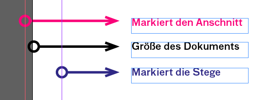

## Basics
- Neues Dokument einrichten mit mit Größe, Seiten, Spalten automatischem Textrahmen und Beschnitt

- verschiedene Objekte auf der Zeichenfläche anlegen und über die Paletten verändern
- Bilder und Texte in ein Dokument laden und platzieren
- Farbpalette
- Objekte duplizieren
- Objekte anordnen und über die Palette Ausrichten
- Hilfslinien anlegen. (Mit Hilfslinien ein Raster aufbauen
